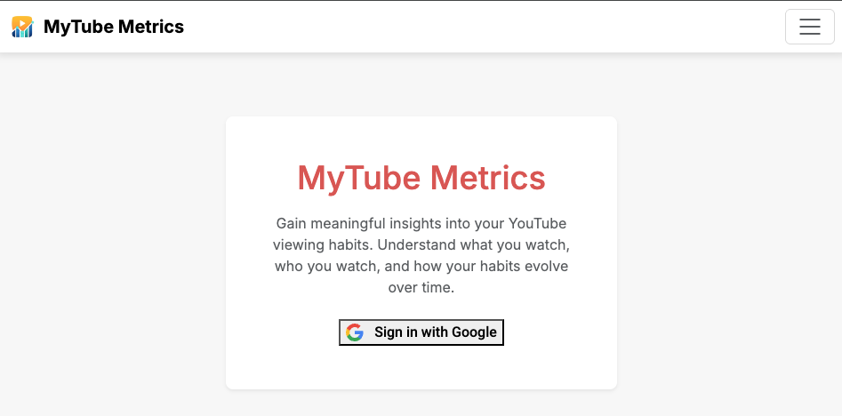

# MyTube Metrics

MyTube Metrics is a web application that provides insightful analytics and visualizations of YouTube viewing habits. It leverages the YouTube Data API to help users understand their content consumption, channel engagement, and how their viewing patterns have changed over time.

## Motivation

Many YouTube users lack structured insight into their viewing habits. `MyTube Metrics` addresses this by providing a web application that offers metrics and visualizations to help users answer key questions about their YouTube consumption, such as:

- What types of content do I watch most (e.g., educational vs. entertainment)?
- Which channels or creators do I engage with the most?
- How have my viewing patterns changed over time?

This helps users understand their content consumption, channel engagement, and how their viewing patterns evolve.

## Features

`MyTube Metrics` provides a comprehensive overview of YouTube consumption through these features:

### 1. Secure Authentication & Authorization

Users log in with Google accounts via OAuth 2.0, granting read-only access to YouTube data, ensuring privacy.

- **Intuitive Web Interface & Data Visualizations:** Interactive charts and tools offer various analytical views:
  - **Subscriptions Analysis:** Paginated lists of subscriptions with key channel statistics and primary content topic tags.
    
  - **Content Affinity Analysis:** Identifies popular topics/categories from the user's "Liked Videos" playlist.
    
  - **Recommended Videos:** Discovers popular videos based on liked content categories, with infinite scrolling.
    
  - **Viewing Habit Evolution:** Upload YouTube Takeout data for watch history, daily/monthly frequencies, and top watched channels.
    
    
- **Future Development:** Ongoing improvements include:
  - Identifying content overlaps between liked videos and subscriptions.
  - Developing a subscription recommendation engine.

## Technologies Used

- **Backend:** Python, Django
- **Frontend:** HTML, CSS, JavaScript, Bootstrap
- **Data Visualization:** Plotly.js
- **Database:** MySQL
- **API Integration:** Google YouTube Data API v3, Google OAuth 2.0

## Contact

LinkedIn: www.linkedin.com/in/jerry-chen751
